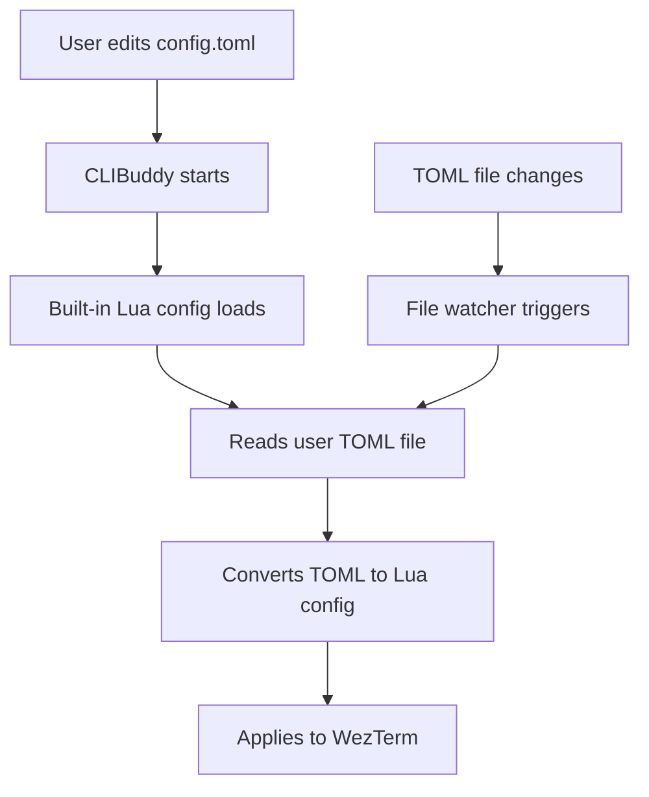

# Internal Lua Configuration System (CLIBuddy Fork)

!!! warning "Internal Documentation"
    This documentation is for CLIBuddy developers and advanced users who need to understand the internal configuration system. **End users should use the [TOML configuration](toml-config.md) instead.**

## Overview

CLIBuddy implements a dual-tier configuration system:

1. **User-facing TOML config** - Simple, readable configuration for common settings
2. **Internal Lua config** - System-managed Lua configuration that loads and processes the TOML file

The internal Lua configuration is built into CLIBuddy and handles the translation between the user's TOML configuration and WezTerm's native Lua configuration system.

## Architecture



## Built-in Lua Configuration Location

The built-in Lua configuration file is located at different paths depending on the installation method:

### Development Builds
- **Path:** `target/release/clibuddy/wezterm.lua`
- **Full Path:** `/path/to/project/target/release/clibuddy/wezterm.lua`

### System Installations

#### Linux (DEB/RPM packages)
- **Path:** `/usr/share/wezterm/config/wezterm.lua`
- **Installed by:** Package manager during installation

#### macOS (App Bundle)  
- **Path:** `WezTerm.app/Contents/Resources/wezterm.lua`
- **Full Path:** `/Applications/WezTerm.app/Contents/Resources/wezterm.lua`

#### Windows (Installer)
- **Path:** `share/wezterm/config/wezterm.lua`
- **Full Path:** `C:\Program Files\WezTerm\share\wezterm\config\wezterm.lua`

## Configuration Search Order

The CLIBuddy binary searches for the built-in configuration file in the following order:

1. **Development/portable mode:** `<executable_dir>/clibuddy/wezterm.lua`
2. **Linux system installation:** `/usr/share/wezterm/config/wezterm.lua`
3. **Windows system installation:** `<executable_dir>/share/wezterm/config/wezterm.lua`
4. **macOS app bundle:** `<bundle>/Contents/Resources/wezterm.lua`

The first existing file found is used. This search is implemented in `wezterm-gui/src/main.rs` in the `set_builtin_config_file()` function.

## Built-in Configuration Structure

The built-in Lua configuration (`clibuddy/wezterm.lua`) contains:

### Platform Detection
```lua
local is_darwin = wezterm.target_triple:find("darwin") ~= nil
local is_linux = wezterm.target_triple:find("linux") ~= nil
local is_windows = wezterm.target_triple:find("windows") ~= nil
```

### User Config Path Resolution
Cross-platform logic to determine where the user's TOML file should be located:

- **Linux:** `~/.config/clibuddy/config.toml` (respects `$XDG_CONFIG_HOME`)
- **macOS:** `~/Library/Application Support/CLIBuddy/config.toml`
- **Windows:** `%APPDATA%\CLIBuddy\config.toml`

### Default TOML Generation
If no user config exists, creates a default TOML file with sensible defaults.

### TOML to Lua Translation
Converts TOML settings to WezTerm Lua configuration:

```lua
-- Example: TOML opacity -> WezTerm config
local opacity = user_config.appearance and user_config.appearance.opacity or 0.8
config.window_background_opacity = 0.999  -- Fixed for compatibility
```

### Hardcoded Defaults
Some settings are hardcoded for consistency:

```lua
config.font = wezterm.font('JetBrains Mono', { weight = 'Medium' })
config.use_fancy_tab_bar = true
config.window_decorations = "TITLE|RESIZE|MACOS_USE_BACKGROUND_COLOR_AS_TITLEBAR_COLOR"
config.automatically_reload_config = true
config.check_for_updates = false
```

## Key Functions

### `get_user_config_path()`
Returns the platform-appropriate path for the user's TOML configuration file.

### `create_default_config(path)`
Creates a default TOML configuration file if none exists.

### `load_user_config()`
Loads and parses the user's TOML file, returns a Lua table.

### `hex_to_rgba(hex_color, opacity)`
Converts hex colors to RGBA format with specified opacity.

### `soften_intensity(hex)`
Utility function to make colors 10% lighter or darker for UI elements.

## File Watching

The built-in config sets up automatic reloading:

```lua
wezterm.add_to_config_reload_watch_list(get_user_config_path())
```

This ensures that changes to the user's TOML file trigger immediate reloading of the configuration.

## Environment Variable Override

The built-in configuration is selected by setting the `WEZTERM_CONFIG_FILE` environment variable in `wezterm-gui/src/main.rs`:

```rust
std::env::set_var("WEZTERM_CONFIG_FILE", &builtin_config);
```

This ensures that WezTerm always uses the CLIBuddy built-in configuration instead of looking for user Lua files in the standard locations.

## Error Handling

The built-in configuration includes error handling for:

- Missing TOML files (creates default)
- Invalid TOML syntax (logs error, uses empty config)
- Missing directories (creates them)
- File permission issues

Errors are logged using `wezterm.log_error()` and `wezterm.log_warn()`.

## Deployment

The built-in configuration file must be included in all distribution packages:

### Development Builds
The `wezterm-gui/build.rs` file automatically copies `clibuddy/wezterm.lua` to the target directory during builds.

### Release Packages
The `ci/deploy.sh` script handles installation:

- **Linux:** Installs to `/usr/share/wezterm/config/wezterm.lua`
- **macOS:** Copies to app bundle Resources directory
- **Windows:** Installs to `share/wezterm/config/wezterm.lua`
- **Alpine:** Installs to `/usr/share/wezterm/config/wezterm.lua`

## Modifying the Built-in Configuration

!!! danger "Development Only"
    The built-in Lua configuration should only be modified by CLIBuddy developers. User configuration should be done through the TOML file.

To modify the built-in configuration:

1. Edit `clibuddy/wezterm.lua`
2. Test with development builds
3. Update documentation if new TOML settings are added
4. Ensure packaging scripts install the updated file

### Adding New TOML Settings

To add a new TOML setting:

1. Add the setting to the default TOML template in `create_default_config()`
2. Add parsing logic in `load_user_config()` 
3. Add the Lua config translation
4. Update the [TOML documentation](toml-config.md)
5. Test across all platforms

## Debugging

### Checking Configuration Loading
Enable debug logging to see configuration loading:

```bash
WEZTERM_LOG=debug wezterm
```

### Verifying File Locations
The built-in config logs its location:

```
INFO  wezterm_gui::main > Using built-in config: /usr/share/wezterm/config/wezterm.lua
```

### TOML Parsing Errors
TOML parsing errors are logged:

```
ERROR wezterm_gui::main > Failed to parse TOML config: expected newline, found string
```

## Security Considerations

- The built-in Lua configuration is read-only to users
- User TOML files are validated before parsing
- No arbitrary code execution through TOML files
- File paths are validated to prevent directory traversal
- Default permissions restrict access to configuration directories

## Compatibility

The dual-tier system maintains compatibility with:

- WezTerm's Lua configuration API
- WezTerm's built-in color schemes
- WezTerm's font handling
- WezTerm's hot-reload functionality

However, it does not support:

- Custom Lua configuration files
- Direct Lua scripting by users
- Custom key bindings via configuration
- Advanced multiplexer configuration